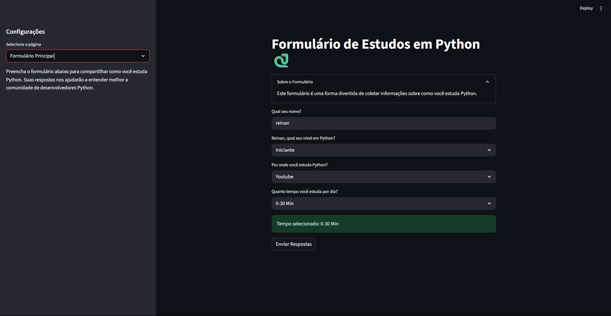

# 🌐 Estudo em Python – Web App (Streamlit)

Uma aplicação interativa desenvolvida com [Streamlit](https://streamlit.io/) que ajuda estudantes e desenvolvedores a refletirem sobre seus hábitos de estudo em Python 🐍.

> ✅ Versão web da aplicação originalmente criada para terminal com InquirerPy.

---

## 🚀 Sobre o Projeto

Este projeto visa promover a **autoavaliação leve e divertida** dos estudos em Python.  
A interface gráfica facilita o preenchimento e é ideal para:

- Bootcamps e cursos
- Estudantes iniciantes/intermediários
- Portfólios de devs em transição de carreira

O app permite ao usuário informar:

- Seu nível atual em Python
- Quanto tempo dedica por dia aos estudos
- Por onde aprende (YouTube, livros, etc.)
- Se utiliza algum framework (como Django ou Flask)

---

## 🧰 Tecnologias

- Python 3.10+
- [Streamlit](https://streamlit.io/) – Framework web
- `st.session_state` – Para controle de estado da aplicação

---

## 📦 Instalação

### 1. Clone o repositório

```bash
git clone https://github.com/CarvalhoReinan/formulario_console.git
cd formulario_console
```

### 2. Instale o Streamlit

```bash
pip install streamlit
```

---

## ▶️ Como Executar

No terminal, execute:

```bash
streamlit run app.py
```

A aplicação será aberta automaticamente no navegador em:

```
http://localhost:8501
```

---

## 📁 Estrutura do Projeto

```
.
├── app.py                # Código principal da versão web
├── formulario-Console.py # Versão terminal (opcional)
├── config.py             # Dados fixos (níveis, métodos, frameworks)
├── perguntas.py          # Lógica de perguntas (terminal)
├── requirements.txt      # Dependências do projeto
└── README.md             # Este arquivo
```

---

## 📸 Preview


---

## 💡 Melhorias Futuras

- Armazenar respostas dos usuários (SQLite ou CSV)
- Recomendação de conteúdos com base nas respostas
- Exportação para PDF
- Adição de gráficos e estatísticas
- Modo escuro e layout mais personalizado

---

## 📄 Licença

Este projeto é open source e livre para uso educacional.  
Contribuições e sugestões são sempre bem-vindas!


---

Feito com 💻 e ☕ por [CarvalhoReinan](https://github.com/CarvalhoReinan)
